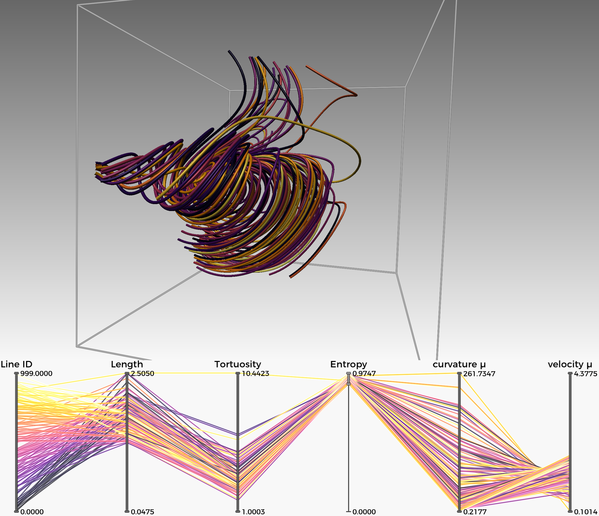

# Vector Field visualization modules for Inviwo
* IntegralLineFiltering: Functionality to convert a `IntegralLineSet` to `DataFrame` containing various metrics of the lines that can be used together with the plotting functionality in the `Plotting` and `PlottingGL` modules in core. See example workspace on how to use it. 

